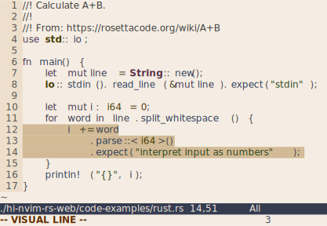
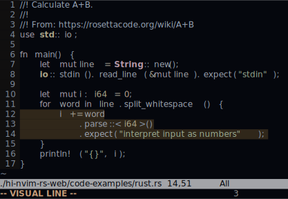
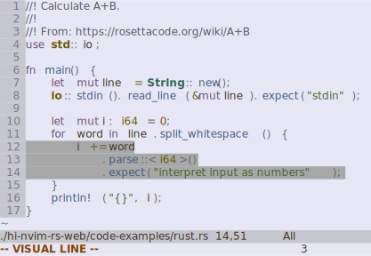
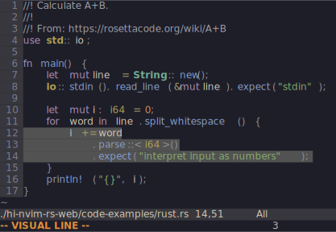
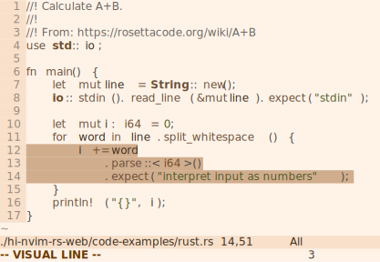
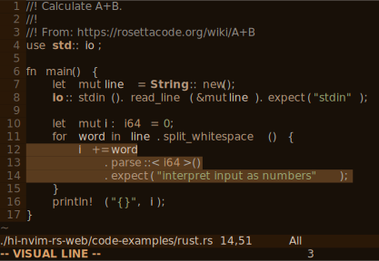
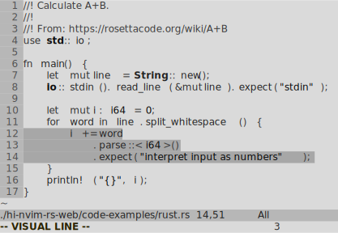
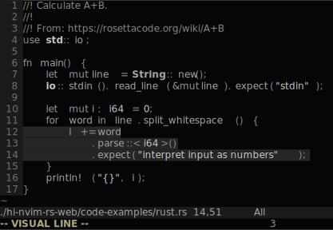

<div align="center">

# hi.nvim.rs

**(Neo)vim perceptual color scheme compiler**

[](#license)
[](#license)
[](https://crates.io/crates/hi-nvim-rs)
[](https://docs.rs/hi-nvim-rs)

</div>

Create (Neo)vim color schemes by defining colors and their transformations.
This uses the Oklab color space to make the perceptual effects of
transformations predictable.

A hosted version is available [here](https://hi-nvim-rs.uint.one).

## Feature summary

- Color schemes are compiled to (Neo)vim configurations with no startup overhead
- Specify colors using lightness, chromacity and hue in the Oklch color space
- If you're creating a dark theme, you get the inverse light theme for free, and vice versa
- A curated set of opinionated default Neovim highlight groups is provided,
  requiring only a few theme definitions to get a consistent color scheme
- Theme colors definitions refer to colors with optional transformations (such
  as lightness and chromacity)
- Override or add any highlight group
- Vim is supported as a secondary target

## Examples

| Light | Dark |
|---|---|
|  |  |

[_highlow_](./colorschemes/highlow.toml): a color scheme with high contrast between background and foreground,
low color saturation, and low contrast between foreground elements.

| Light | Dark |
|---|---|
|  |  |

[_verf_](./colorschemes/verf.toml): a colorful color scheme.

| Light | Dark |
|---|---|
|  |  |

[_twocolor_](./colorschemes/twocolor.toml): a color scheme using (mostly) just two hues.

| Light | Dark |
|---|---|
|  |  |

[_grayscale_](./colorschemes/grayscale.toml): a color scheme, sans color.

These screenshots were generated using
[Termsnap](https://github.com/tomcur/termsnap).

## Getting started

To run the CLI version, run

```shell
$ cargo install hi-nvim-rs
$ hi-nvim-rs --help
$ hi-nvim-rs ./path/to/colorscheme.toml > ~/.config/nvim/colors/a-colorscheme-name.vim
```

## Color scheme configurations

In hi.nvim.rs color scheme configurations, you define the hues you want to use
in your color scheme, as well as the default lightness and chromacity of
various color groups (background and foreground colors, for example). You then
derive the desired theme elements of your color scheme by referring to these
hues with optional color transformations: lightening/darkening,
saturating/desaturating and color mixing. Neovim highlight group colors refer
to these theme elements. One theme element can be common to various highlight
groups, such as various types of seperators in Neovim referring to a single
`ui.bg_border` theme element.

See [_highlow_](./colorschemes/highlow.toml) for a color scheme configuration
with an inline explanation of the various configuration settings.

### Default highlight groups 

hi.nvim.rs provides opinionated default highlight groups for Neovim and some
plugins. These are defined in
[default_highlights.toml](./default_highlights.toml). When creating your color
schemes you can choose to base your configuration on these defaults, optionally
overriding some of them, or you can completely ignore them. If you use them,
make sure you define all the theme elements referenced by the default
highlights. A good starting point is to take a look at the `[themes]` section
in [_highlow_](./colorschemes/highlow.toml).
